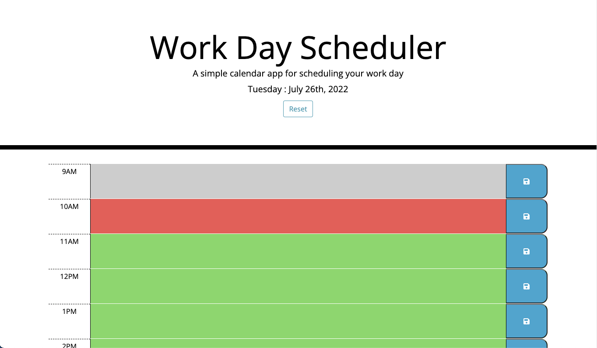
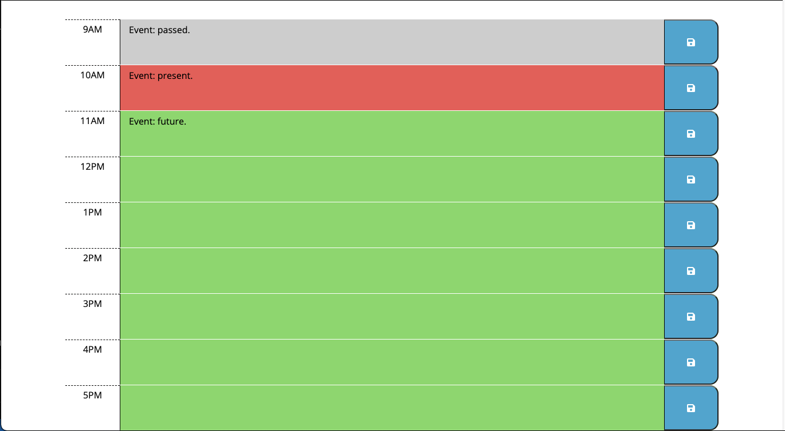

# personal-workday-scheduler

## Description

\
User Story
```
AS AN employee with a busy schedule
I WANT to add important events to a daily planner
SO THAT I can manage my time effectively
```

\
Acceptance Criteria
```
GIVEN I am using a daily planner to create a schedule
WHEN I open the planner
THEN the current day is displayed at the top of the calendar
WHEN I scroll down
THEN I am presented with time blocks for standard business hours
WHEN I view the time blocks for that day
THEN each time block is color-coded to indicate whether it is in the past, present, or future
WHEN I click into a time block
THEN I can enter an event
WHEN I click the save button for that time block
THEN the text for that event is saved in local storage
WHEN I refresh the page
THEN the saved events persist
```

## Process

1. Modified provided HTML code by adding sections for each of the time blocks (9AM - 5PM).
    - Added id's to each one to determine time value

2. Created JS file to provide scheduler functionality:

```
Current date to be displayed at top of page.

Functions used:
    - Save button function/reset button function (saves input to locat storage)
    - usePlanner(); ensures input remains after page refresh
    - timeBlock(); assigns background colors to each time block based on current hour (past, present, future)
```

## Screenshots



## Links
<a href="https://devinlachnicht.github.io/personal-workday-scheduler/" target="_blank">Deployed Application</a>

